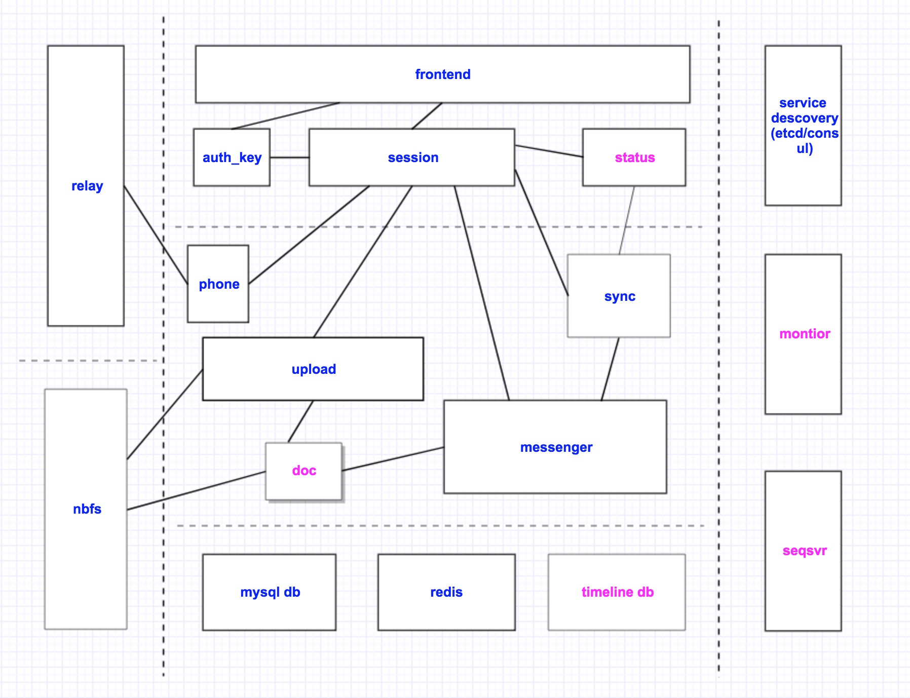

# airwide.datacenter 
> a high-performance, stable server airwide client ecosystem 

### Introduction 
  Airwide Data Center, based on the Go programming technology, 
   includes but not limited to the following features:

- [mtprotoc](https://github.com/airwide-code/airwide.mtprotoc.git)Code generator
   - Automatically convert tl to protobuf protocol 
   - Automatically generate codec code of tl binary data, 
     which can convert the binary data received by the client tl into a protobuf object, 
     and access it through grpc 

- [dalgen](https://github.com/airwide-code/airwide.dal.generator.git)Data access layer code generator
   - Integrated sqlparser parser, automatically generate dao code through configurable sql
   - Check sql syntax when generating code, greatly reducing the chance of error in traditional
     handwritten sql implementation and the workload of handwritten sql calls

- Support for switchable multiple service registration and discovery systems

- Integration of grpc's recovery and other middleware

### Architecture diagram

### Documents

- [Diffie–Hellman key exchange](doc/dh-key-exchange.md)

- [Creating an Authorization Key](doc/Creating_an_Authorization_Key.md)

- [Mobile Protocol: Detailed Description (v.1.0, DEPRECATED)](doc/Mobile_Protocol-Detailed_Description_v.1.0_DEPRECATED.md)

- [Encrypted CDNs for Speed and Security](doc/cdn.md) [@steedfly](https://github.com/steedfly)翻译

### Compile and install

[Compile and install](doc/build.md)

[Compile and run the script](scripts/build.sh)

[Dependency script](scripts/prerequisite.sh)

### Supporting client

#### Official open source client to modify the adaptation version

[Android client for telegramd](https://github.com/nebulaim/TelegramAndroid)

[macOS client for telegramd](https://github.com/nebulaim/TelegramSwift)

[iOS client for telegramd](https://github.com/nebulaim/TelegramiOS)

[tdesktop for telegramd](https://github.com/nebulaim/tdesktop/tree/telegramd)

Web client (stay tuned)

#### Open source client library modification adaptation version 
tdlib

### TODO
channels, Secret Chats, bots and payments. These major functions have not been realized yet.

### Technical exchange group 
Bug feedback, comments and suggestions are welcome to join [Telegramd Chinese Technical Exchange Group](https://t.me/joinchat/D8b0DQ-CrvZXZv2dWn310g) discuss。

## English

### Introduce
open source mtproto server implement by golang, which compatible telegram client.

### Install
[Build and install](doc/build.md)

[build](scripts/build.sh)

[prerequisite](scripts/prerequisite.sh)

## Feedback
Please report bugs, concerns, suggestions by issues, 
or join telegram group [Telegramd](https://t.me/joinchat/D8b0DRJiuH8EcIHNZQmCxQ) 
to discuss problems around source code.
